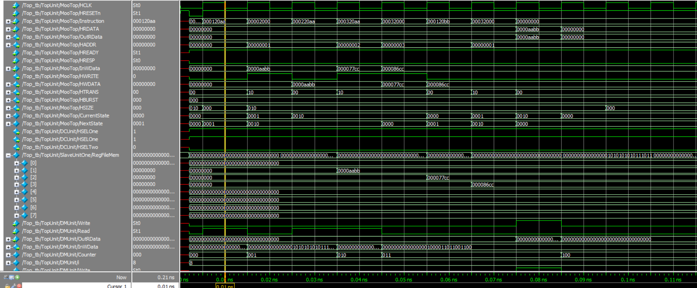
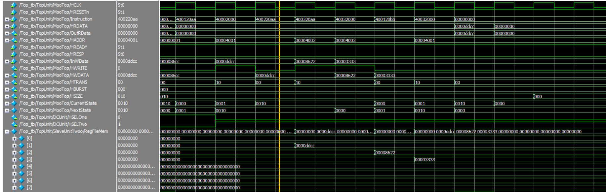

# AHB 
The **Advanced High-Performance Bus (AHB)** is part of ARM's **AMBA** standard, designed for fast, high-efficiency communication within system-on-chip (SoC) architectures. AHB supports high-speed data transfers between processors, memory, and peripherals, using a pipelined structure to minimize delays. It is ideal for embedded systems, enabling burst transfers, single-cycle memory access, and reliable error handling, making it crucial for applications requiring high performance and low power consumption.

 
*Figure 1: AHB Architectue*

---
## AMBA 
**AMBA** (Advanced Microcontroller Bus Architecture) is a widely used open-standard protocol developed by ARM to manage communication between different functional blocks within a **System-on-Chip (SoC)**. It ensures efficient data transfer between the processor, memory, and peripherals in embedded systems.

AMBA includes multiple bus protocols, each designed for different performance needs:
- **AHB (Advanced High-Performance Bus)**: Used for high-speed data transfers between processors and memory.
- **APB (Advanced Peripheral Bus)**: A simpler, lower-speed bus for peripherals like timers and UARTs.
- **AXI (Advanced eXtensible Interface)**: More advanced, supporting high-performance, parallel communication and flexibility in SoCs.

AMBA helps streamline system integration, enhance reusability, and improve system performance in embedded designs.

---
## AHB - Master

An AHB master is a key component in the Advanced High-Performance Bus (AHB) system, responsible for initiating read and write operations on the bus. It generates addresses, controls data transfers, and manages signals to communicate with memory and other peripherals. The master can request control of the bus to perform high-speed transactions, while other components act as slaves, responding to its requests.

 
*Figure 2: AHB Master Architectue*

---

## Reference 
An AHB master will be designed to comply with the AMBA® 3 AHB-Lite Protocol v1.0 standard, ensuring compatibility and high performance. 

### Supported Features

- Single-Master Architecture
- Pipelined Operations
- Single-Cycle Data Transfers
- Burst Transfers
- Simple Handshake Mechanism
  - HREADY
  - HRESP
- Transfer Types
  - idle 
  - busy
  - non - sequential
  - sequential 
- Wait States Support
- Read and Write Operations

### Unsupported Features

- Multilayer AHB-Lite
- Protection (HPROT)
- Master lock (HMASTLOCK)
- WRAP4, INCR4, WRAP8, INCR8, WRAP8, INCR8 of HBURST

---
## Design Methodology 

Our design consists of five key blocks:

- **Instruction Memory:** This block stores data and outputs one instruction per cycle.
- **Sign extender:** It extracts the lower 16 bits from an instruction and expands them to 32 bits. The master device has 16-bit addresses (allowing for 65,536 addresses), but the address is extended to 32 bits to comply with the standard.
- **AHB Master:** Based on the decoder's output, this block decides whether to take control of the bus or remain idle.
- **Data Memory:** It provides data to the master during write operations and receives data during read operations.

 
*Figure 3: System Architectue*

The master has an internal decoder that reads the first 8 bits from the control bus to decide whether to perform a read, write, or remain idle. If it's a read operation, the decoder also determines whether it's a single or INCR burst and transitions to the corresponding state accordingly.

 
*Figure 4: Instruction Bus*

- Write = `0xAA`
- Read  = `0xBB `
- Back to SEQ after BUSY= `0xCC` 

 
*Figure 5: Finite State Machine*

- Start = `IDLE`
- Address = `NONSEQ`
- DATA = 
  - New Data =  `NONSEQ` 
  - NoN New Data =  `IDLE`
- AddressINCR = `NONSEQ`
- DataSeq 
  - INCR = `SEQ`
  - New Data =  `NONSEQ` 
  - NoN New Data =  `IDLE`
- Busy = `BUSY`

---
## Master - Verification
The first six test cases focus on verifying various scenarios for write operations. These include testing single burst transfers where bursts occur without overlap, meaning they do not follow each other immediately, allowing the transfer to return to the idle state. Additionally, consecutive single bursts and consecutive INCR bursts are tested, the latter ending with a stop signal. The tests also include INCR bursts with overlapping and non-overlapping bursts. In the overlapping case, bursts follow each other immediately, so the transfer does not return to the idle state.

The following six tests apply similar scenarios but for read operations.

Tests 13 and 14 evaluate the master's behavior when HREADY becomes low, while tests 15 and 16 assess the master's behavior during a busy state and when HREADY goes low during the busy state. These tests also verify the master's ability to change the HTRANS state.

The complete list of test cases is summarized in the accompanying table.

| Test       | Single Burst | INCR | Read | Write | Overlapp | HREADY | BUSY |
|------------|:------------:|:----:|:----:|:-----:|:--------:|:------:|:----:|
| Test Cae 1 |  1           | 0    | 0    | 1     |  0       | 0      | 0    |  
| Test Cae 2 |  1           | 0    | 0    | 1     |  1       | 0      | 0    | 
| Test Cae 3 |  1           | 0    | 0    | 1     |  1       | 0      | 0    | 
| Test Cae 4 |  0           | 1    | 0    | 1     |  0       | 0      | 0    | 
| Test Cae 5 |  0           | 1    | 0    | 1     |  0       | 0      | 0    | 
| Test Cae 6 |  0           | 1    | 0    | 1     |  1       | 0      | 0    | 
| Test Cae 7 |  1           | 0    | 1    | 0     |  0       | 0      | 0    | 
| Test Cae 8 |  1           | 0    | 1    | 0     |  1       | 0      | 0    | 
| Test Cae 9 |  1           | 0    | 1    | 0     |  1       | 0      | 0    | 
| Test Cae 10|  0           | 1    | 1    | 0     |  0       | 0      | 0    | 
| Test Cae 11|  0           | 1    | 1    | 0     |  0       | 0      | 0    | 
| Test Cae 12|  0           | 1    | 1    | 0     |  1       | 0      | 0    | 
| Test Cae 13|  1           | 0    | 0    | 1     |  0       | 1      | 0    | 
| Test Cae 14|  0           | 1    | 1    | 0     |  1       | 1      | 0    | 
| Test Cae 15|  0           | 1    | 1    | 0     |  0       | 0      | 1    | 
| Test Cae 16|  0           | 1    | 1    | 0     |  0       | 1      | 1    | 

---

## Master - Simulation 

 
*Figure 6: Test Case 1*

 
*Figure 7: Test Case 2*

 
*Figure 8: Test Case 3*

 
*Figure 9: Test Case 4*

 
*Figure 10: Test Case 5*

 
*Figure 11: Test Case 6*

 
*Figure 12: Test Case 7*

 
*Figure 13: Test Case 8*

 
*Figure 14: Test Case 9*

 
*Figure 15: Test Case 10*

 
*Figure 16: Test Case 11*

 
*Figure 17: Test Case 12*

 
*Figure 18: Test Case 13*

 
*Figure 19: Test Case 14*

 
*Figure 20: Test Case 15*

 
*Figure 21: Test Case 16*

---
## AHB - Slave

An AHB slave is a crucial component in the Advanced High-Performance Bus (AHB) system, responsible for responding to read and write requests initiated by the AHB master. It processes the addresses and control signals generated by the master, either providing the requested data or accepting the data to be written. The slave does not initiate transactions but waits for commands from the master, handling data transfers to and from memory or other peripherals. The AHB slave's role is essential for ensuring smooth communication in high-speed systems, enabling efficient interaction with various devices on the bus.

 
*Figure 22: AHB Slave Architectue*

---

## Slave - Verification and Simulation
During verification, I tested several features like read, write, and SRIO while `HREADY` was deasserted, and all operations were successfully completed.

 
*Figure 23: TC1 - Write*

 
*Figure 24: TC2 - Write Write*

 
*Figure 25: TC3 - HREADY Deasserted*

 
*Figure 26: TC4 - Read*

---
## Integration

Our system includes a master connected to both an instruction memory and a data memory for loading and storing data. The master is integrated with two slave components: memory one and memory two. My objective was to implement the AHB protocol, and I chose to use two memory slaves to differentiate between them during integration.

Bits 14 and 15 of the address were selected for decoding and multiplexing between the slaves. Our system currently supports up to four slaves, with the capability to extend this further.

## Integration - Verification and Simulation
During the master and slave verification, I tested several scenarios covering the protocol's functionalities. In the system verification, I tested write and read overlap on both slaves, ensuring data is correctly stored in the slave during writing and in the data memory during reading. The results were successful.

 
*Figure 27: TC1 - Slave One*

 
*Figure 28: TC1 - Slave One*

 
*Figure 29: TC2 - Slave Two*

 
*Figure 27: TC2 - Slave Two*

---

## Future Work 
Multiple masters can be utilized to implement a multi-master AHB system, and different types of slaves can be employed to meet real-world requirements. Our instruction and data memory could also function as FIFO instead of regular slave memory, with the potential for enhanced protection.

---